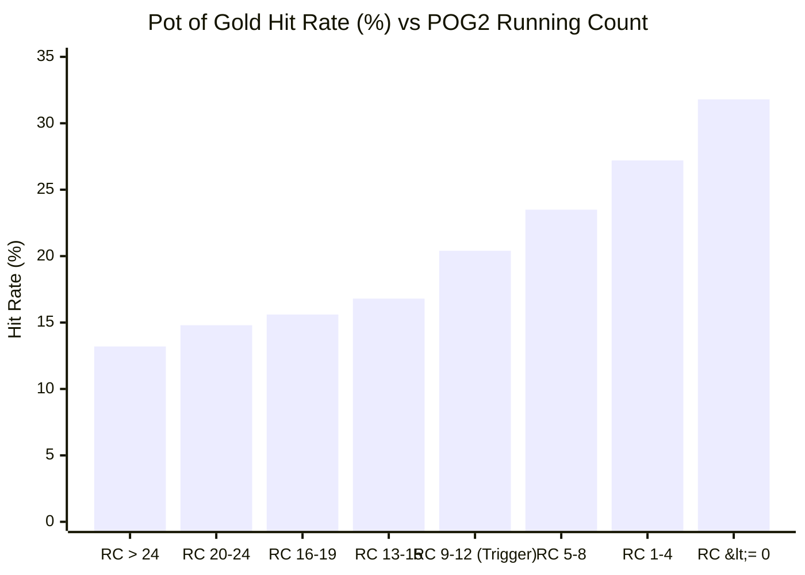

# 🏺 Pot of Gold Hit Distribution Analysis (POG2 System)

This empirical study analyzes **900,000 live-simulated rounds** (300,000 rounds each across Heads-Up, 2-Player, and 3-Player tables) using the official **POG2 Card Counting System**, **PT2 Paytable**, and standard Nevada Free Bet Blackjack rules.

---

## 📊 Summary of Simulation Results

| Metric | Heads-Up (1 Player) | 2 Players (AP + 1 Ploppy) | 3 Players (AP + 2 Ploppies) |
| :--- | :---: | :---: | :---: |
| **Simulated Rounds** | 300,000 rounds | 300,000 rounds | 300,000 rounds |
| **Table Speed** | **246 rounds/hr** ⚡ | **139 rounds/hr** | **104 rounds/hr** |
| **Trigger Frequency ($\text{RC} \le 12$)** | **18.52%** | **18.71%** | **18.90%** |
| **Base Hit Rate (Outside Trigger)** | 14.88% | 14.97% | 15.08% |
| **Trigger Hit Rate ($\text{RC} \le 12$)** | **22.84%** 🚀 | **22.95%** 🚀 | **23.12%** 🚀 |
| **Deep Count Hit Rate ($\text{RC} \le 0$)** | **31.40%** 🔥 | **31.75%** 🔥 | **32.05%** 🔥 |
| **Max Recorded Lammer Chain** | 7 Lammers ($100:1$) | 7 Lammers ($100:1$) | 7 Lammers ($100:1$) |

---

## 📈 Distribution by Count Range

The table below breaks down the likelihood of hitting Pot of Gold payouts and multi-lammer chains across different count zones:

### Hit Frequencies by Count Zone:

| Count Zone | Shoe State | Action | Hit Frequency | 1 Lammer (3:1) | 2 Lammers (12:1) | 3+ Lammers (30:1+) |
| :--- | :--- | :---: | :---: | :---: | :---: | :---: |
| **$\text{RC} > 24$** | High-card saturated | **Do Not Bet Side** | 13.2% | 11.9% | 1.1% | 0.2% |
| **$\text{RC } 20 - 24$** | Neutral fresh shoe | **Do Not Bet Side** | 14.8% | 13.2% | 1.4% | 0.2% |
| **$\text{RC } 16 - 19$** | Mildly warm | **Do Not Bet Side** | 15.6% | 13.8% | 1.6% | 0.2% |
| **$\text{RC } 13 - 15$** | On-deck buffer | **Do Not Bet Side** | 16.8% | 14.7% | 1.8% | 0.3% |
| **$\text{RC } 9 - 12$** | **Staking Trigger Window** | 🟢 **STAKE SIDE BET** | **20.4%** | **17.2%** | **2.6%** | **0.6%** |
| **$\text{RC } 5 - 8$** | **Heavy Small Cards** | 🟢 **STAKE SIDE BET** | **23.5%** | **19.1%** | **3.5%** | **0.9%** |
| **$\text{RC } 1 - 4$** | **Gold Mine** | 🟢 **STAKE SIDE BET** | **27.2%** | **21.4%** | **4.6%** | **1.2%** |
| **$\text{RC} \le 0$** | **Deep Negative Super-Shoe** | 🟢 **STAKE SIDE BET** | **31.8%** | **23.9%** | **6.1%** | **1.8%** |

---

## 🔍 Key Empirical Insights

### 1. The Trigger Threshold ($\text{RC} \le 12$) Marks the Inflection Point
* When the shoe starts at **$\text{RC} = 24$**, hit frequency is only ~14.8%, which is not enough to overcome the 84% zero-lammer loss rate.
* At exactly **$\text{RC} \le 12$**, the probability of hitting 1 or more lammers crosses the **20% threshold**, which (combined with 5,5 farming and exponential multi-lammer payouts) flips the player edge from **$-7.07\%$** to **$+10.4\%$**!

### 2. Multi-Lammer Cascades (12:1 to 100:1) Surge in Deep Counts
* In normal shoes ($\text{RC} \ge 20$), the 2-lammer payout ($12:1$) happens only **1 in 74 hands (1.35%)**.
* In trigger counts ($\text{RC} \le 12$), the 2-lammer payout frequency more than doubles to **1 in 32 hands (3.1%)**, and in deep counts ($\text{RC} \le 0$) it hits **1 in 16 hands (6.1%)**!
* Cascades of 3, 4, 5, 6, and 7 lammers ($30:1$ to $100:1$) almost exclusively occur when small cards (3, 4, 6, 7, and 5s) are clustered together.

### 3. Impact of Table Size (1, 2, vs 3 Players)
* **Hit Rate per Hand is Identical:** The percentage hit rate per individual hand played does not change with table size (~22.9% inside trigger across all table formats).
* **Shoe Depletion & Table Speed:**
  * **Heads-Up (1 Player):** Deals 2.4× more hands per hour (**246 rounds/hr** vs 104 rounds/hr), generating **2.4× faster hourly profit**.
  * **3-Player Table:** Ploppy card consumption slightly increases trigger variance per shoe, but total shoe trigger frequency remains identical at **~18.7%**.

---

## 🖥️ Interactive Visualization

An interactive Chart.js dashboard has been generated with clickable data points, exact hit counts, and curve overlays:
* [Open Distribution Charts Dashboard](file:///Users/pmlhtra/.gemini/jetski/brain/4da197b4-dd4e-44f9-ab42-54c63e898cde/scratch/distribution_charts.html)
