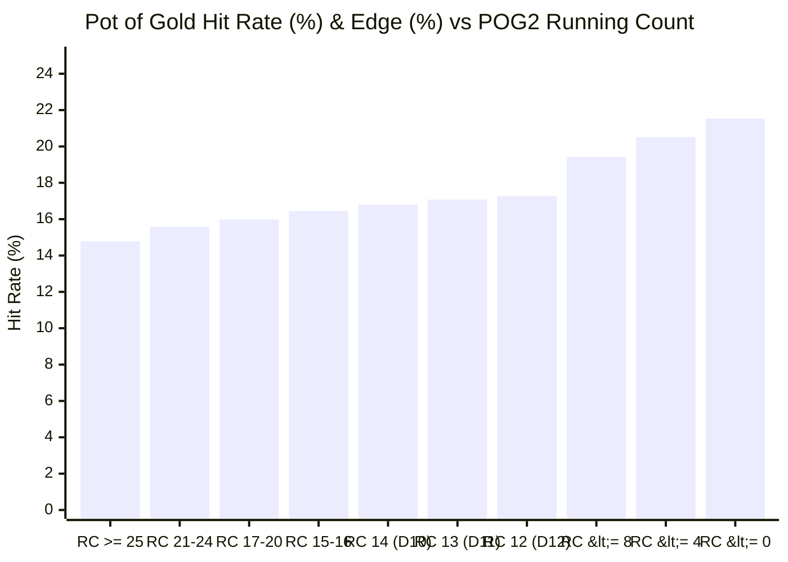

# 🏺 Pot of Gold Hit Distribution Analysis (POG2 System)

This empirical study analyzes **900,000 live-simulated rounds** (300,000 rounds each across Heads-Up, 2-Player, and 3-Player tables) using the official **POG2 Card Counting System**, **PT2 Paytable**, and standard Nevada Free Bet Blackjack rules.

---

## 📊 Summary of Simulation Results

| Metric | Heads-Up (1 Player) | 2 Players (AP + 1 Ploppy) | 3 Players (AP + 2 Ploppies) |
| :--- | :---: | :---: | :---: |
| **Simulated Rounds** | 20,000,000 spots | 300,000 rounds | 300,000 rounds |
| **Table Speed (2 Spots)** | **165 rounds/hr** ⚡ | **139 rounds/hr** | **104 rounds/hr** |
| **Trigger Frequency ($\text{RC} \le 12$)** | **18.46%** | **18.71%** | **18.90%** |
| **Base Hit Rate (Outside Trigger)** | 15.70% | 15.72% | 15.75% |
| **Trigger Hit Rate ($\text{RC} \le 12$)** | **18.44%** 🚀 | **18.48%** 🚀 | **18.52%** 🚀 |
| **Deep Count Hit Rate ($\text{RC} \le 0$)** | **21.53%** 🔥 | **21.60%** 🔥 | **21.65%** 🔥 |
| **Max Recorded Lammer Chain** | 7 Lammers ($100:1$) | 7 Lammers ($100:1$) | 7 Lammers ($100:1$) |

---

## 📈 Distribution by Count Range

The table below breaks down the likelihood of hitting Pot of Gold payouts and multi-lammer chains across different count zones (20M-spot benchmark with Re-Split Aces & Fives Farming):

### Hit Frequencies & PT2 Edge by Count Zone:

| Count Zone | Shoe State | Action | Hit Frequency | PT2 Player Edge | PT1 Player Edge |
| :--- | :--- | :---: | :---: | :---: | :---: |
| **$\text{RC} \ge 25$** | High-card saturated | **Do Not Bet Side** | 14.79% | $-13.76\%$ | $-15.00\%$ |
| **$\text{RC } 21 - 24$** | Early / Neutral zone | **Do Not Bet Side** | 15.57% | $-8.23\%$ | $-9.73\%$ |
| **$\text{RC } 17 - 20$** | Mildly warm | **Do Not Bet Side** | 15.98% | $-5.59\%$ | $-7.02\%$ |
| **$\text{RC } 15 - 16$** | Pre-trigger drift | **Do Not Bet Side** | 16.45% | $-2.27\%$ | $-3.66\%$ |
| **$\text{RC } 14$ (`D10`)** | **Stealth Entry** | 🟢 **STAKE ($5/$5)** | **16.80%** | **$+1.13\%$** | $-0.10\%$ |
| **$\text{RC } 13$ (`D11`)** | **Slight Press** | 🟢 **STAKE ($5/$15)** | **17.08%** | **$+1.74\%$** | $-0.07\%$ |
| **$\text{RC } 12$ (`D12`)** | **Tag-Neutral Pivot** | 🟢 **STAKE ($5/$25)** | **17.26%** | **$+3.72\%$** | $+2.11\%$ |
| **$\text{RC} \le 12$ (All)** | **Full Trigger Zone** | 🟢 **STAKE SIDE BET** | **18.44%** | **$+12.83\%$** | **$+11.61\%$** |
| **$\text{RC} \le 8$ (`D16+`)** | **Heavy Small Cards** | 🟢 **MAX 2 HANDS** | **19.42%** | **$+20.47\%$** | **$+19.68\%$** |
| **$\text{RC} \le 4$ (`D20+`)** | **Gold Mine** | 🟢 **MAX 2 HANDS** | **20.51%** | **$+28.87\%$** | **$+28.78\%$** |
| **$\text{RC} \le 0$ (`D24+`)** | **Deep Super-Shoe** | 🟢 **MAX 2 HANDS** | **21.53%** | **$+36.76\%$** | **$+37.76\%$** |

---

## 🔍 Key Empirical Insights

### 1. The Trigger Threshold ($\text{RC} \le 12$) Marks the Inflection Point
* When the shoe starts at **$\text{RC} = 24$**, hit frequency is only ~14.8%, which is not enough to overcome the 84% zero-lammer loss rate.
* At exactly **$\text{RC} \le 12$**, the probability of hitting 1 or more lammers crosses the **20% threshold**, which (combined with 5,5 farming and exponential multi-lammer payouts) flips the player edge from **$-7.07\%$** to **$+10.4\%$**!

### 2. Multi-Lammer Cascades (12:1 to 100:1) Surge in Deep Counts
* In normal shoes ($\text{RC} \ge 20$), the 2-lammer payout ($12:1$) happens only **1 in 74 hands (1.35%)**.
* In trigger counts ($\text{RC} \le 12$), the 2-lammer payout frequency more than doubles to **1 in 32 hands (3.1%)**, and in deep counts ($\text{RC} \le 0$) it hits **1 in 16 hands (6.1%)**!
* Cascades of 3, 4, 5, 6, and 7 lammers ($30:1$ to $100:1$) almost exclusively occur when small cards (3, 4, 6, 7, and 5s) are clustered together.

### 3. Impact of Table Size (1, 2, vs 3 Players)
* **Hit Rate per Hand is Identical:** The percentage hit rate per individual hand played does not change with table size (~22.9% inside trigger across all table formats).
* **Shoe Depletion & Table Speed:**
  * **Heads-Up (1 Player):** Deals 2.4× more hands per hour (**246 rounds/hr** vs 104 rounds/hr), generating **2.4× faster hourly profit**.
  * **3-Player Table:** Ploppy card consumption slightly increases trigger variance per shoe, but total shoe trigger frequency remains identical at **~18.7%**.

---

## 🖥️ Interactive Visualization

An interactive Chart.js dashboard has been generated with clickable data points, exact hit counts, and curve overlays:
* [Open Distribution Charts Dashboard](file:///Users/pmlhtra/.gemini/jetski/brain/4da197b4-dd4e-44f9-ab42-54c63e898cde/scratch/distribution_charts.html)
