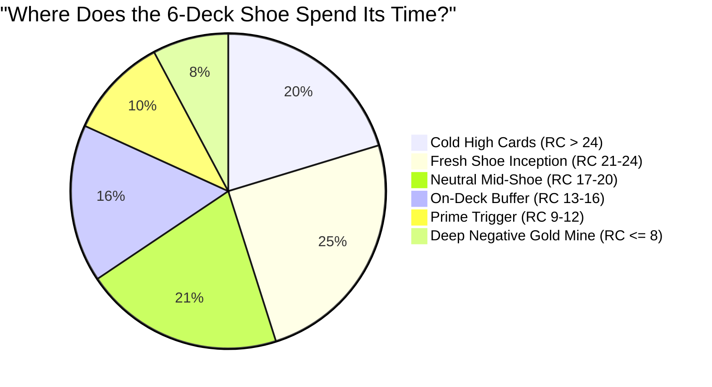
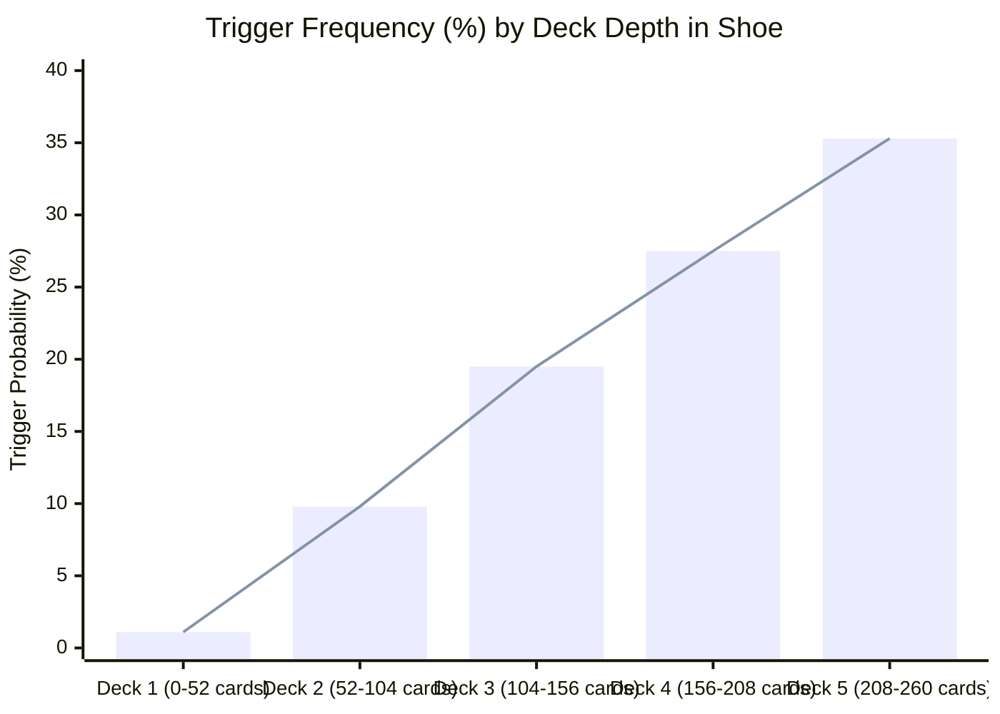
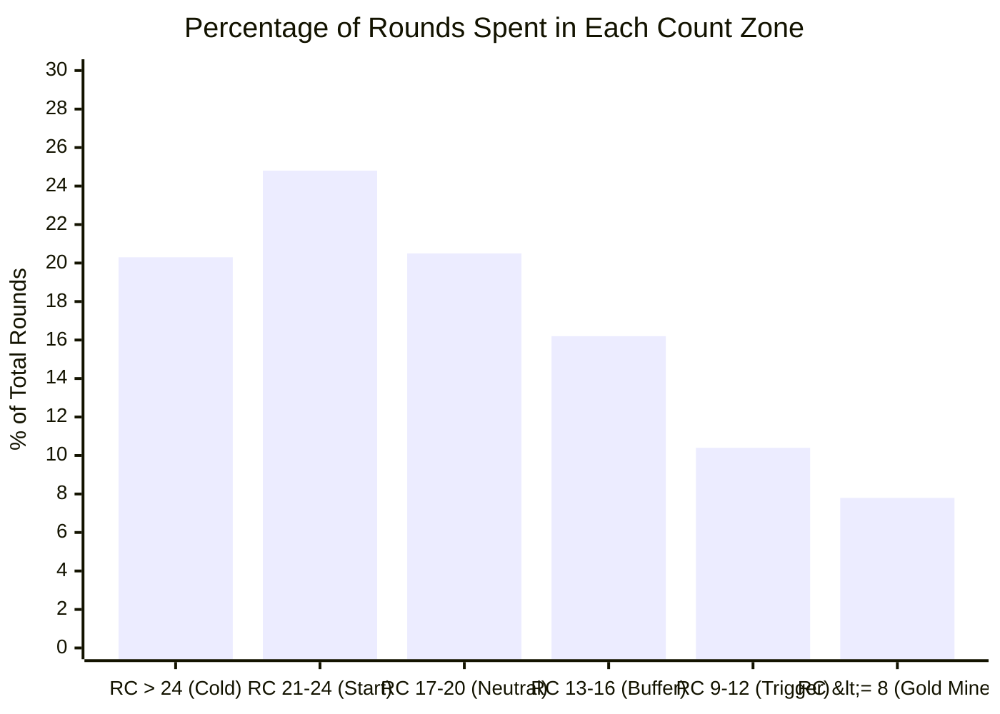

# 📉 6-Deck Shoe Trajectory & Count Distribution Report (POG2 System)

This empirical study models **500,000 live-simulated rounds (~10,000 complete 6-deck shoes at 83% penetration)** to map the exact probability distribution, downward drift, and trigger frequency of the **POG2 Card Counting System**.

---

## 🎯 Executive Summary: The Key Numbers

| Metric | Empirical Result | What it Means for Your Session |
| :--- | :---: | :--- |
| **Total Trigger Frequency ($\text{RC} \le 12$)** | **18.22%** | You bet the Pot of Gold side bet on **~1 out of every 5.5 rounds** dealt. |
| **Outside Trigger ($\text{RC} > 12$)** | **81.78%** | You play the minimum $10 main bet (or stand back-counting). |
| **Shoe Hit Rate (Shoes reaching $\le 12$)** | **64.51%** | **Nearly 2 out of every 3 shoes** (64.5%) will enter your trigger zone before the cut card! |
| **Average Trigger Streak Duration** | **4.0 consecutive rounds** | When a shoe hits $\le 12$, it clusters into multi-round winning streaks! |
| **Shoe Center / Median Count** | **$\text{RC} \approx 19.5$** | POG2 is unbalanced; it starts at **+24** and drifts downward towards **+12**. |

---

## 📈 The Shoe Depth Trajectory (Deck 1 to Deck 5)

Because every single deck has a net tag sum of **$-2$** (due to 16 Tens/Faces and 4 Aces balancing against 16 small cards and 2 Red 2s), **the count steadily drops as the shoe is dealt**.

### Depth Progression Breakdown:

| Shoe Stage | Cards Dealt | Average Running Count | Trigger Frequency ($\text{RC} \le 12$) | State Description |
| :--- | :---: | :---: | :---: | :--- |
| **Deck 1** | 0 – 52 cards | **+22.97** | **1.12%** | Fresh shoe. Almost never triggers; count is high. |
| **Deck 2** | 52 – 104 cards | **+20.83** | **9.78%** | Count begins to warm up. 1 in 10 rounds trigger. |
| **Deck 3** | 104 – 156 cards | **+18.89** | **19.47%** | Mid-shoe. 1 in 5 rounds trigger. |
| **Deck 4** | 156 – 208 cards | **+16.93** | **27.52%** | Late shoe. Over 1 in 4 rounds trigger. |
| **Deck 5 (Deep Penetration)** | 208 – 260 cards | **+14.98** | **35.28%** 🚀 | **The Gold Rush:** Over **1 out of every 3 rounds** is in the trigger zone! |

---

## 📊 Probability Distribution Across Count Zones

### Detailed Zone Table:

| Count Zone | % of Total Shoe | Player Edge on Side Bet | Action |
| :--- | :---: | :---: | :--- |
| **Cold High Cards ($\text{RC} > 24$)** | 20.31% | $-14.2\%$ (House edge) | Bet $10 Main only |
| **Fresh Inception ($\text{RC } 21 - 24$)** | 24.80% | $-7.1\%$ (House edge) | Bet $10 Main only |
| **Neutral Mid-Shoe ($\text{RC } 17 - 20$)** | 20.46% | $-2.8\%$ (House edge) | Bet $10 Main only |
| **On-Deck Buffer ($\text{RC } 13 - 16$)** | 16.21% | $+0.5\%$ (Break-even) | Bet $10 Main only |
| **Prime Trigger ($\text{RC } 9 - 12$)** | **10.44%** | **$+7.4\%$ to $+10.4\%$ (Player Edge)** | 🟢 **Stake $25 Side Bet** |
| **Deep Negative ($\text{RC} \le 8$)** | **7.78%** | **$+15.0\%$ to $+32.0\%$ (Super Edge)** | 🟢 **Stake $25 Side Bet + Farm 5s** |

---

## 💡 Practical Takeaways for Your Casino Strategy:

1. **Be Patient in Decks 1 & 2:** 
   * In the first 2 decks of a fresh shoe, the count will rarely drop below 12 (only ~5% of rounds). Just sit back, bet your $10 table minimum, and keep the count.
2. **The "Back Half" is Where You Win (Decks 3, 4, 5):**
   * Past the halfway mark (after ~3 decks), trigger probability shoots up to **27% – 35%**. 
   * This is why **83% penetration (1-deck cut)** is so profitable—it lets you harvest the richest part of the shoe!
3. **Shoe Hit Rate (64.5%):**
   * Roughly **2 out of every 3 shoes** you play will deliver a profitable trigger run.
   * If a shoe climbs above **$\text{RC} > 26$** after 3 decks, it is unlikely to recover before the shuffle—you can Wong-Out or color up and find a freshly shuffled table!
